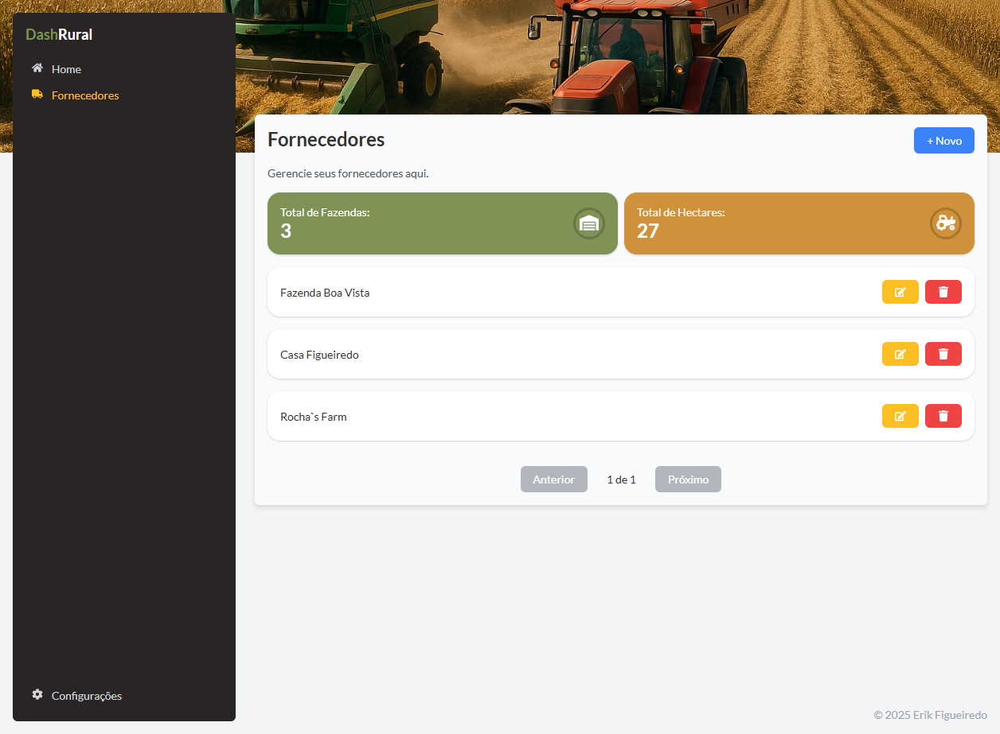

# Projeto Rural Front

Este é o front-end do projeto Rural, desenvolvido com React e Vite. Ele fornece uma interface moderna e responsiva para gerenciar dados relacionados a fornecedores e outras funcionalidades.

## Estrutura do Projeto

Abaixo está uma visão geral da estrutura de pastas do projeto:

```
- src/
  - components/
  - hooks/
  - layouts/
  - lib/
  - pages/
  - routes/
```

## Como Rodar o Projeto

1. Certifique-se de ter o Node.js e o Yarn instalados.
2. Instale as dependências:
   ```bash
   yarn install
   ```
3. Rode o projeto em ambiente de desenvolvimento:
   ```bash
   yarn dev
   ```
4. Para gerar o build de produção:
   ```bash
   yarn build
   ```

## Imagens do Projeto

Abaixo estão algumas imagens ilustrativas do projeto:





## Comandos Úteis

- `yarn dev`: Inicia o servidor de desenvolvimento.
- `yarn build`: Gera os arquivos para produção.
- `yarn test`: Executa os testes automatizados.